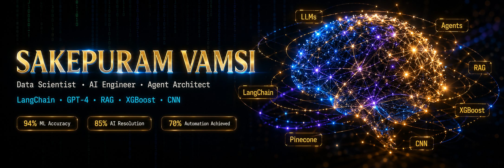

<!-- ██╗   ██╗ █████╗ ███╗   ███╗███████╗██╗
   ██║   ██║██╔══██╗████╗ ████║██╔════╝██║
   ██║   ██║███████║██╔████╔██║███████╗██║
   ╚██╗ ██╔╝██╔══██║██║╚██╔╝██║╚════██║██║
    ╚████╔╝ ██║  ██║██║ ╚═╝ ██║███████║██║
     ╚═══╝  ╚═╝  ╚═╝╚═╝     ╚═╝╚══════╝╚═╝  -->

<div align="center">
  
</div> 

<div align="center">
  
</div>

<br/>

<div align="center">

[](https://linkedin.com/in/vamsi-sakepuram-datascience)
[](mailto:vamsisakepuram232@gmail.com)
[](https://github.com/VAMSISAKEPURAM)
[](https://github.com/VAMSISAKEPURAM)

</div>

---

## 🧑‍💻 Who Am I?

```python
#!/usr/bin/env python3
# ──────────────────────────────────────────────────────────────────────
#  Sakepuram Vamsi  ·  Data Scientist & AI Engineer  ·  Bangalore, India
# ──────────────────────────────────────────────────────────────────────

class DataScientist:

    def __init__(self):
        self.name        = "Sakepuram Vamsi"
        self.role        = "Data Scientist @ AI/ML LABS Pvt. Ltd."
        self.experience  = "1+ Years in Production AI/ML Systems"
        self.location    = "📍 Bangalore, India | Open to Relocation"
        self.education   = "B.Sc. Maths & CS — Sri Venkateswara University (CGPA: 9.10)"

        self.what_i_build = [
            "🤖  Agentic AI systems  →  LangChain + GPT-4 + ReAct Pattern",
            "🔍  RAG pipelines       →  Pinecone + FAISS + OpenAI Embeddings",
            "📊  Predictive ML       →  XGBoost + SHAP + Bayesian Tuning",
            "🌿  Computer Vision     →  CNN + TensorFlow + Transfer Learning",
            "⚙️  End-to-end deploy   →  FastAPI + Streamlit + Docker",
        ]

        self.proven_results = {
            "Churn Prediction Accuracy"  : "94% (XGBoost + ensemble)",
            "First-Contact Resolution"   : "85% (AI Agent, no human needed)",
            "Manual Ticket Routing Cut"  : "70% reduction",
            "RAG Recommendation Relevance": "88%",
            "Retention Campaign Lift"    : "+18% pilot improvement",
        }

        self.achievements = [
            "🥇  ANVESHAN 2025 — University 1st Place (Data Science)",
            "🥈  ANVESHAN 2025 — South Zone Runner-Up",
            "🥉  AI4LIFE Hackathon 2026 — 2nd Place @ IISER Tirupati",
        ]

        self.currently   = "Open to Data Scientist & AI Engineer roles"
        self.motto       = "In God we trust. All others must bring data. — W.E. Deming"

    def say_hi(self):
        print("I build AI that solves real problems. Let's connect 🚀")

me = DataScientist()
me.say_hi()
```

---

## 🏆 Results That Matter

<div align="center">

| Metric | Result | Project |
|:-------|:------:|:--------|
| 🎯 Churn Model Accuracy | **94%** | XGBoost + Ensemble + SHAP |
| 🤖 First-Contact Resolution | **85%** | Agentic AI Support System |
| ⚡ Manual Routing Reduction | **70%** | LangChain + GPT-4 Agent |
| 💡 RAG Recommendation Relevance | **88%** | Pinecone + GPT-4 Embeddings |
| 🚀 SpaceX Launch Prediction | **96%** | IBM Capstone — Scikit-learn |
| 🌿 Crop Disease Detection | **94%** | CNN — TensorFlow/Keras |
| 📈 Retention Campaign Lift | **+18%** | Churn Risk Segmentation |
| ⏱️ Report Turnaround Cut | **-50%** | NLP-to-SQL Agent |

</div>

---

## 🛠️ Tech Stack

<div align="center">

### ⚡ Agentic AI & Generative AI


### 🧠 Machine Learning


### 🔬 Deep Learning & Computer Vision


### 🐍 Programming & Data


### 🚀 Deployment & Tools


</div>

---

## 💼 Professional Experience

<div align="center">
  
  &nbsp;
  
</div>

<br/>

> *End-to-end ML & GenAI engineering · Agent deployment · Stakeholder analytics · Production monitoring*

| # | What I Built | Impact |
|---|-------------|--------|
| 🤖 | Multi-turn Agentic AI support system — LangChain + GPT-4, ReAct pattern, ConversationBufferMemory, tool integrations | **85% first-contact resolution · 92% escalation detection · 70% less manual routing** |
| 💡 | GenAI Customer Insights Engine — RAG pipeline (Pinecone + GPT-4 embeddings), transformer sentiment analysis, few-shot marketing content | **88% recommendation relevance** |
| 📊 | Customer Churn Prediction — XGBoost + ensemble, 50+ features, Bayesian tuning, SHAP explainability | **94% accuracy · +18% pilot retention lift** |
| 🔗 | LangChain semantic search, lookalike segmentation, unstructured feedback analysis, model drift monitoring | **Production-grade · Continuous tracking** |
| 🗄️ | NLP-to-SQL agents for natural language DB queries; Power BI dashboards for C-suite KPI tracking | **−50% report turnaround · Real-time visibility** |
| ⚙️ | Automated reporting with Python pipelines, CNN/ANN computer vision tasks via TensorFlow & Keras | **+40% team productivity · 90%+ CV accuracy** |

---

## 🚀 Featured Projects

<table>
<tr>
<td width="50%" valign="top">

### 🤖 Intelligent Customer Support AI Agent
> **Agentic AI · LangChain · GPT-4 · Production**


- 🧠 Multi-turn conversational agent with ConversationBufferMemory
- 🔧 Tools: ticket lookup · order history · KB search · refund processing
- 🎯 Intent classification + entity extraction via LLMs
- 📊 **85% first-contact resolution · 92% escalation accuracy · 70% less routing**
- 🖥️ Deployed via Streamlit — real-time agent action transparency

</td>
<td width="50%" valign="top">

### 💡 Customer Insights & Personalization Engine
> **Generative AI · RAG · Pinecone · NLP**


- 🔍 RAG pipeline (Pinecone + GPT-4) for personalised product recommendations
- ✍️ Automated marketing content via few-shot prompting
- 💬 Transformer-based sentiment analysis for churn & satisfaction drivers
- 🎯 Embedding similarity search for lookalike customer segmentation
- 📈 **88% recommendation relevance score**

</td>
</tr>

<tr>
<td width="50%" valign="top">

### 📊 Customer Churn Prediction & Retention
> **Machine Learning · XGBoost · SHAP · MLOps**


- ⚙️ 50+ engineered features from transaction, demographic & behavioural data
- 🔬 Bayesian hyperparameter tuning + cross-validation
- 💥 SHAP explainability — top 5 churn drivers identified
- 📡 Model monitoring pipeline with drift detection
- 🎯 **94% accuracy · +18% pilot campaign retention**

</td>
<td width="50%" valign="top">

### 🌾 SmartAgri-AI
> **Computer Vision · CNN · Weather API Integration**


- 🌿 CNN model for crop leaf disease detection
- 💊 AI pesticide & crop recommender from soil + weather data
- ☁️ Weather-integrated disease forecasting & spray scheduling
- 🛒 Farmer-buyer communication platform with price discovery
- 🎯 **94% accuracy on leaf disease images**

</td>
</tr>

<tr>
<td width="50%" valign="top">

### 🧴 SkinCare-AI
> **Computer Vision · Generative AI · Healthcare**


- 📸 Image-based skin disease diagnosis via CNN classifier
- 💊 AI generates complete step-by-step treatment roadmap
- 🏥 Recommends medicines, home remedies & lifestyle changes
- ⚠️ Severity grading with smart doctor-referral triggers

</td>
<td width="50%" valign="top">

### 🎓 University Chatbot & DocuMind
> **RAG · LangChain · Vector Search · NLP**


- 🏫 24/7 institutional chatbot grounded on official documents
- 📄 DocuMind: upload PDF/DOCX/TXT → ask anything, get cited answers
- 🔍 Semantic chunking for pinpoint retrieval accuracy
- 💬 Contextual memory across multi-turn conversations

</td>
</tr>
</table>

---

## 🏅 Achievements

<div align="center">

| 🏅 | Award | Event | Year |
|:--:|:------|:------|:----:|
| 🥇 | **1st Place** | ANVESHAN — University Level Data Science | 2025 |
| 🥈 | **Runner-Up** | ANVESHAN — South Zone Level | 2025 |
| 🥉 | **2nd Place** | AI4LIFE Hackathon — IISER Tirupati | 2026 |

</div>

---

## 📜 Certifications

<div align="center">

[](https://www.coursera.org/)
&nbsp;
[](https://www.scaler.com/)
<br/><br/>
[](https://intellipaat.com/)
&nbsp;
[](https://intellipaat.com/)
&nbsp;
[](https://www.udemy.com/)

</div>

---

## 🎓 Education

<div align="center">

| 🎓 Qualification | 🏫 Institution | 📊 Score |
|:----------------|:--------------|:--------:|
| B.Sc. Mathematics & Computer Science (2021–2024) | Sri Venkateswara University | **CGPA: 9.10** |
| Intermediate — MPC (2019–2021) | Sai Sri Chaitanya Jr. College | **831 / 1000** |
| SSC (2018–2019) | Municipal High School | **GPA: 7.8** |

</div>

---

## 📊 GitHub Analytics

<div align="center">
  
  &nbsp;
  
</div>

<div align="center">
  
</div>

<div align="center">
  
</div>

---

## 🤝 Let's Connect

<div align="center">

> *I'm actively looking for **Data Scientist** and **AI Engineer** roles where I can ship production systems that matter.*
>
> *Reach me at **vamsisakepuram232@gmail.com** — I reply fast.*

<br/>

[](mailto:vamsisakepuram232@gmail.com)
&nbsp;
[](https://linkedin.com/in/vamsi-sakepuram-datascience)
&nbsp;
[](https://github.com/VAMSISAKEPURAM)

<br/>

*"In God we trust. All others must bring data." — W. Edwards Deming*

</div>

<div align="center">
  
</div>
